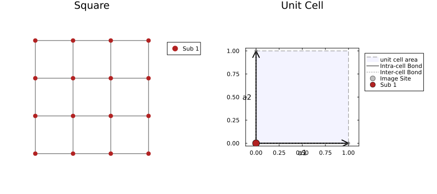
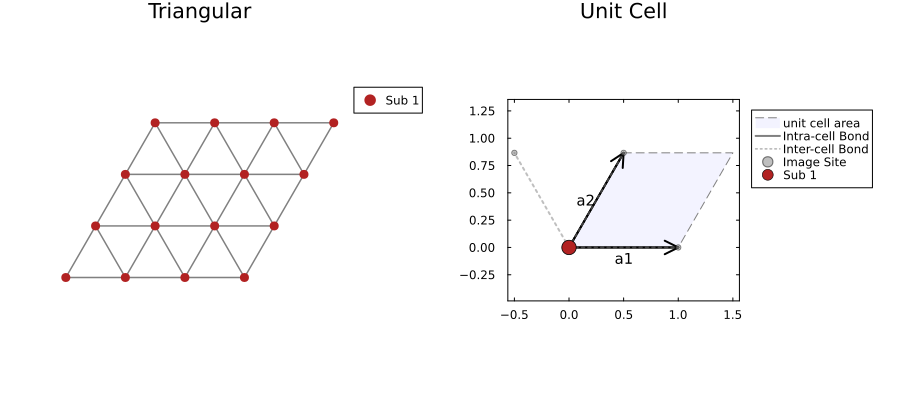
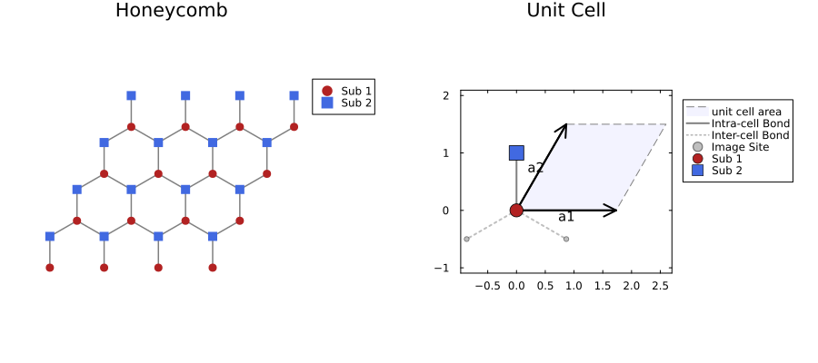
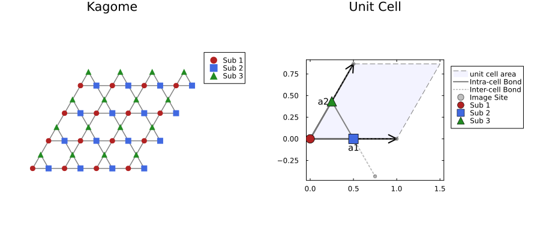
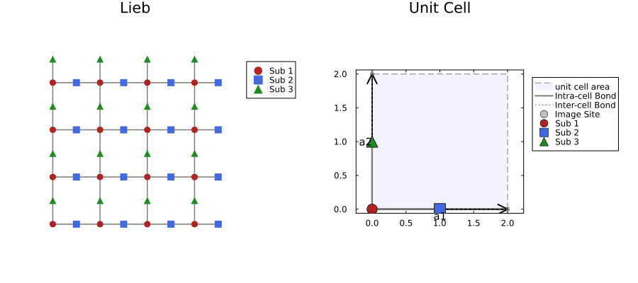

# Supported Lattices

`Lattices.jl` provides lattices showed below. In each figure, left side shows lattice shape, and right side shows definition of unit cells.  

## Square lattice

The most fundamental 2D bipartite lattice with coordination number $z=4$.
It has a single site per unit cell and does not exhibit geometric frustration. Often used as a standard benchmark for 2D quantum many-body algorithms.

## Triangular lattice

A lattice consisting of equilateral triangles with coordination number $z=6$.
It is a prototypical example of a geometrically frustrated lattice (non-bipartite), famous for the $120^\circ$ magnetic order in the Heisenberg model.

## Honeycomb lattice

A hexagonal lattice structure found in Graphene.
It is a bipartite lattice with coordination number $z=3$ and contains **2 sites** (sublattices A and B) in the unit cell.

## Kagome lattice

A lattice consisting of corner-sharing triangles with coordination number $z=4$.
It contains **3 sites** in the unit cell. Known for strong geometric frustration and as a candidate host for Quantum Spin Liquids (QSL).

## Lieb lattice

A lattice formed by removing the center sites from a $2 \times 2$ cluster of the square lattice, or decorating the edges of a square lattice.
It is a bipartite lattice characterized by a **flat band** in its energy spectrum and ferrimagnetic ground states (Lieb's theorem).

## Shastry-Sutherland lattice

A square lattice with additional orthogonal diagonal bonds (dimers).
It is geometrically frustrated and realized in the material $\text{SrCu}_2(\text{BO}_3)_2$. The model is famous for having an exact dimer-singlet ground state in a certain parameter region.

